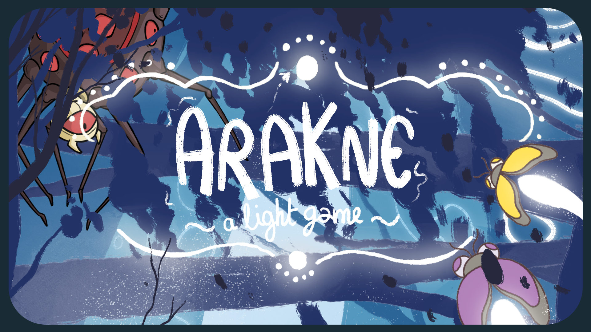
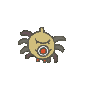
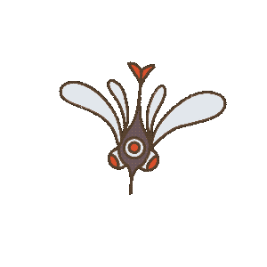
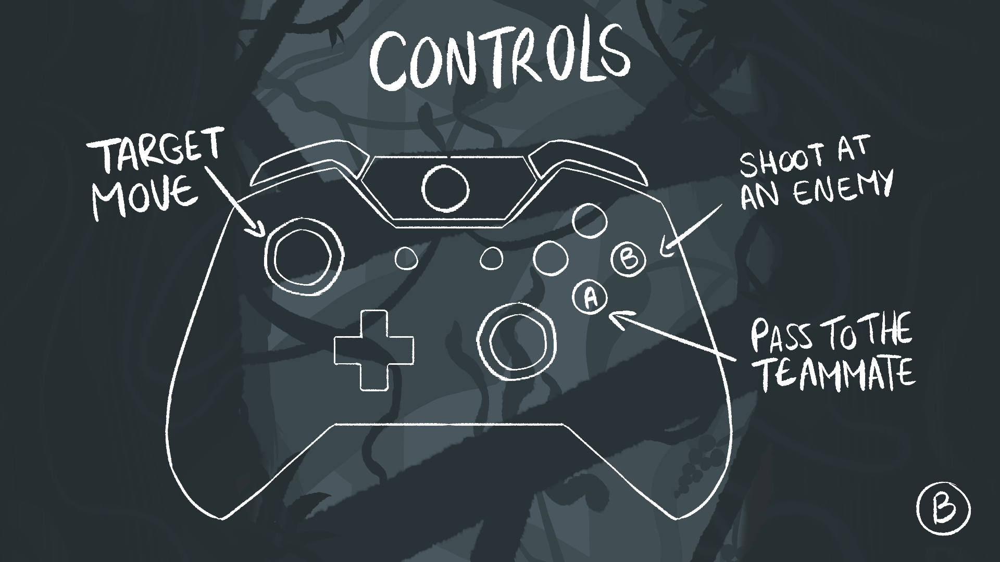
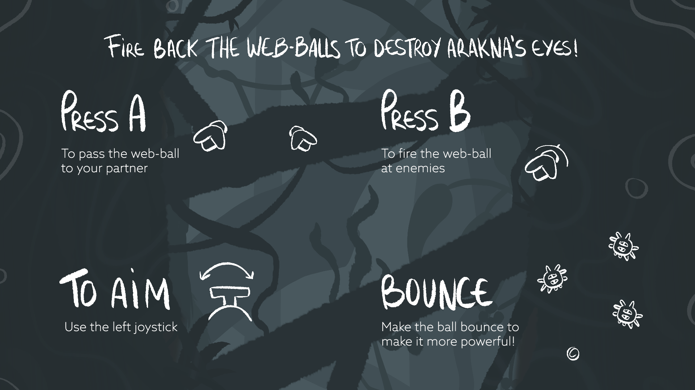

# **Arakne : a light game**

## Presentation

>Game Made on ENJMIN 2023 Nano Projects
>
>11 people team on 4 full-days work

"Arakne : a light game" is a shoot 'em up game that offers a cooperative and strategic experience, where light challenges darkness.

Immerse yourself in the heart of the forest, where two fireflies join forces to protect their home against a malevolent spider and its army of insects. 

Your mission : eradicate all insects and defeat the spider to restore peace in the forest. As you embody these fireflies, collaborate to confront the relentless waves of insects unleashed by the spider and devise attack strategies. Stay vigilant, as this spider won't easily relinquish its reign of terror.

Prepare to shine and fight together for the peace and harmony of the forest.

This game is playable only on PC with two controllers.

If you want to play again after a game, you currently have to restart the game.

## Features

- Playable with controller
- Cooperation local
- Bouncing ball
- Boss fight
- Scoring system

## Team

| Member  |   |
| ----- | - |
| 👔 [Tim Bolla](https://boolti.itch.io/)                   | Project Manager   |
| 🎲 [Emma-Louise Bot](https://malou76.itch.io/)            | Game Design       |
| 🎲 [Vasco Mendes Ferreira](https://itch.io/profile/worlix)| Game Design       |
| 💻 [Théophile Carrasco](https://eyecrown.itch.io/)        | Developer         |
| 💻 [Antonin Lombard](https://antonin-lombard.itch.io/)    | Developer         |
| 🧠 [Manon Rougelin](https://manonrgln.itch.io/)           | Ergonomic         |
| 🖌️ [Gabrielle Laty](https://itch.io/profile/gabrioche)    | Visuals           |
| 🖌️ [Brice Bonnefond](https://bryssbo.itch.io/)            | Visuals           |
| 🖌️ [Gabriel Purnelle](https://shinobouu.itch.io/)         | Visuals           |
| 🎵 [Romain Belet](https://swiitsh.itch.io/)               | Sound Design      |
| 🎵 [Enzo Tittarelli](https://kygen-sondidier.itch.io/)    | Sound Design      |